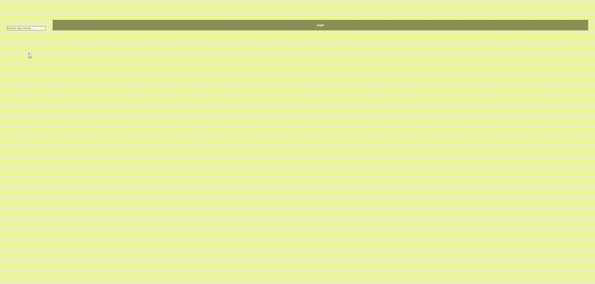

# Cards
> Projeto com React para fins educacionais <a href="https://cards-mu-orpin.vercel.app/"> clique aqui. </a>


<a href="https://github.com/carlosbandelli">

</a>

<a href="#">

</a>

<a href="#">

</a>

<a href="https://github.com/carlosbandelli/Cards/commits/main">

</a>

<div style="margin: 0 auto;">

</div>

<hr/>

## 💡 Sobre o projeto:

Este projeto faz parte de um desafio que consistia em desenvolver  uma aplicação que permitisse ao usuário digitasse seu nome em num campo de uma pagina e assim que ele aperta o botão ele seria direcionado para outra pagina com o nome no canto superior direito e nessa pagina aparece 5 cartas com um numero randomico em cada uma delas, junto com dois botões um para embaralhar e outro para adicionar mais uma carta até o maximo de 8 cartas, quando chegar a 8 cartas ele nao pode sacar mais. Sobre a parte técnica do desafio poderia ser de acordo com a escolha do desenvolvedor, poderia ser um site, um app eu escolhi o Vite-React para o desafio por ser a stack que atualmente estou estudando e também por ser a stack usada para a vaga referente a esse desafio.Para poder ver a aplicação online <a href="https://cards-mu-orpin.vercel.app/"> clique aqui. </a>

##🔥 Quais são as funcionalidades?

-Iniciamos com 5 cartas aleatorias, que voce poderá apertar o botão para embaralhar
-Voce pode compara até 3 cartas para totalizar 8 cartas e assim poder embaralha-las

## ⚙️ Techs:
-Vite & React

-Javascript

## ⛏ Ferramentas:

- [Visual Studo Code](https://code.visualstudio.com/download)

## 🏁 Configuração ambiente:

Para executar a aplicação:

### Chave SSH:
```bash
 git clone git@github.com:carlosbandelli/Cards.git
```

### Chave HTTPS:
```
git clone https://github.com/carlosbandelli/Cards.git
```

Execute na raiz para baixar as dependências:

```
npm install
```

Para iniciar a aplicação execute na raiz:

```
npm run dev
```

## 😎 Pontos principais do projeto:

### - Consumo da API vem da pasta src/utils/load-post.jsx:
Nesse arquivos tranformei ele em componente e usei a biblioteca axios.js como forma de consumo.
Nele fiz duas requisições uma para fotos e outra para post uni os dois com o metodo .map e spread,
pois na requisição havia mais foto do que post então usei os post como referencia e assim poder dar match na união de ambos
e fiz o retorno para apenas 10 cartas como metodo .splice:
 Conforme código abaixo:
 
 ```
 import axios from 'axios';

export const loadPosts = async () => {
    const postsResponse = axios.get('http://jsonplaceholder.typicode.com/posts');
    const photosResponse = axios.get('http://jsonplaceholder.typicode.com/photos');
  
    const [posts, photos] = await Promise.all([postsResponse, photosResponse]);
  
    const postsJson = await posts.data;
    const photosJson = await photos.data;
  
    const postsAndPhotos = postsJson.map((post, index) => {
      return { ...post, cover: photosJson[index].url };
    });
    return postsAndPhotos.splice(0,10);
  };

```

<hr/>

### Home page, aqui onde fica o nucleo do projeto:

Um breve resumo desse parte, eu coloquei os estados inicias do projeto com duas variaveis que começa com 5 e o maxim o vai ate 8, construi um hook para redenrização e uma função para randomizar a lista que vai ser gerada. conforme código abaixo:

```
  useEffect(() => {
    const handleLoadPosts = async () => {
      const postsAndPhotos = await loadPosts();
      const shuffledPosts = shuffleList(postsAndPhotos);
      
      setPosts(shuffledPosts.splice(0, MIN_START)); //mao
      setAllPosts(shuffledPosts); //pilha
      setLoading(false);
    };

    handleLoadPosts();
  }, [])

  const shuffleList = (list) => list.sort(() => Math.random() - 0.5)
```
-Para embaralhar as cartas que estou na tela criei uma função.
Conforme código abaixo:

```
 const shuffleList = (list) => list.sort(() => Math.random() - 0.5)

const handleShuffle = () => {
    const shuffledPosts = shuffleList(posts);
    setPosts([...shuffledPosts])
  };

```

- Para adicionar até no maximo 8 cartas criei mais uma função que ele pega lista original de 10 escolhe uma carta aleatoriamente adiciona no array e faço um spread e um splice para pegar o indice do array e cartar par apenas uma item e junto com a lista que ja existia. conforme código abaixo:

```
const loadMorePosts = () => {
    if(isHandFull) return;

    const allPostsTemp = allPosts;

    const i = Math.floor( Math.random() * (allPostsTemp.length-1 + 1) ); //random index
    
    setPosts([...posts, ...allPostsTemp.splice(i, 1)]);
    setAllPosts(allPostsTemp);
  };

```

